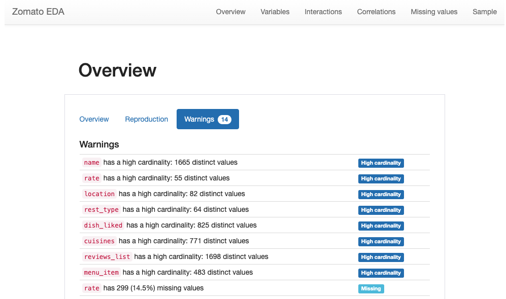
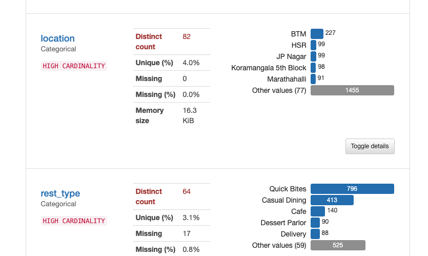

EDA-Pandas-Profiling

One of the effiecient and optimal way to go for EDA.

No need to build the code and graphs from scratch anymore.

Here, we can see a little more indepth analysis of the same.

 
